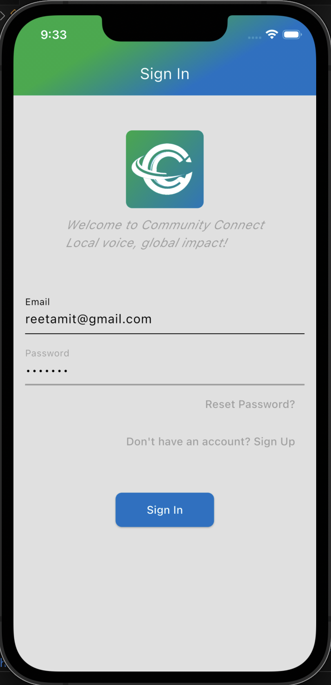
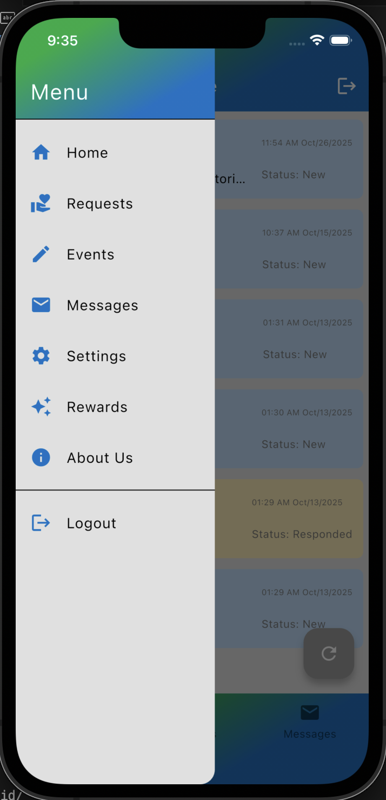
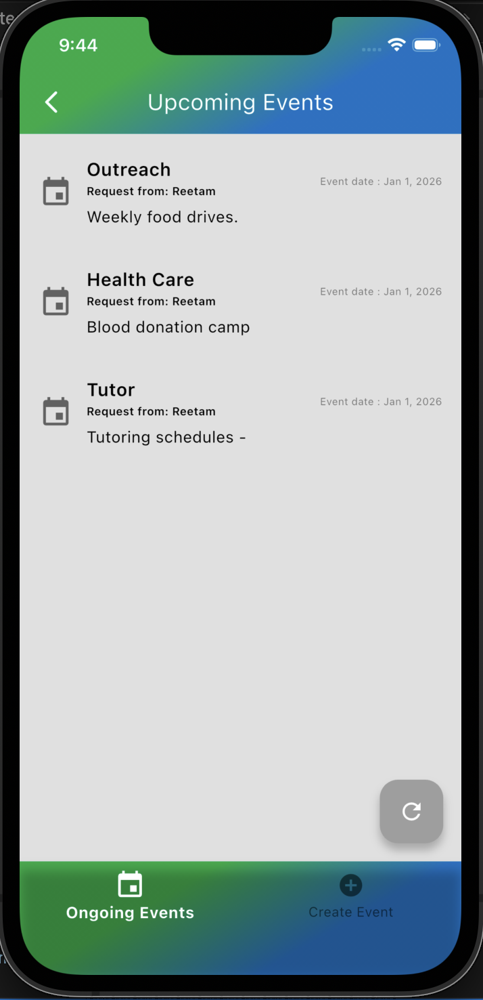
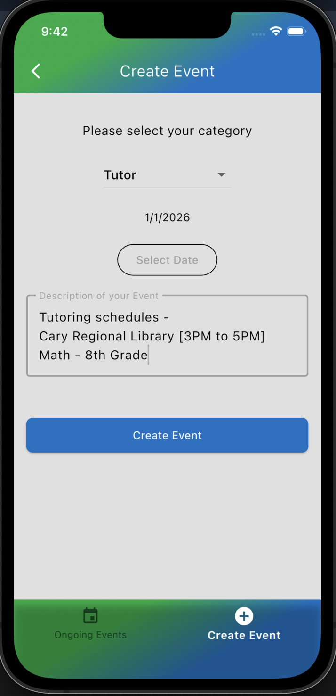
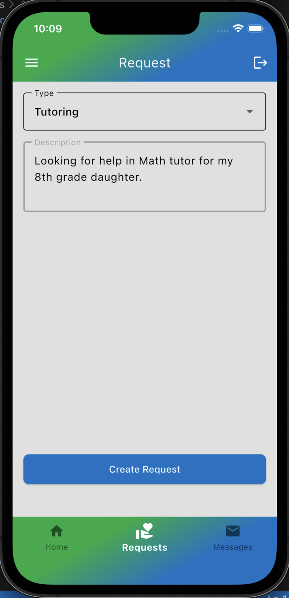
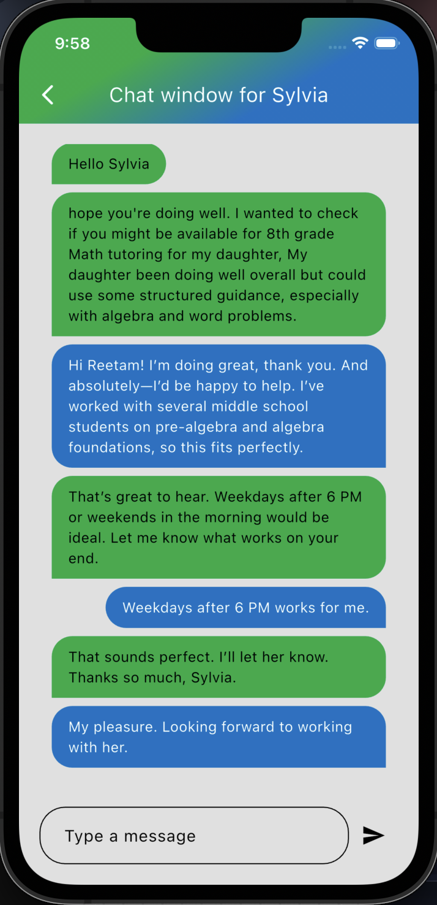

<p align="center">
  <!-- PROJECT LOGO -->
  
</p>

<h1 align="center">Community Connect</h1>

<p align="center">
  Bringing people together through events, conversations, and shared purpose.
</p>

<p align="center">
  <!-- BADGES -->
  
  
  
  
</p>

---

## 🌍 A More Human Story

Communities thrive when people feel connected — when they know what’s happening around them, who shares their interests, and where they can contribute.  
**Community Connect** was born from a simple belief:  
**technology should strengthen real‑world relationships, not replace them.**

This project began as a way to help neighborhoods, student groups, volunteer circles, and local organizations coordinate more easily. Over time, it evolved into a full‑featured, cross‑platform app that blends event discovery, messaging, and community engagement into a single, intuitive experience.

Whether you're organizing a charity drive, joining a local meetup, or simply looking to meet people nearby, Community Connect gives you the tools to make it happen.

---

## ✨ Features at a Glance

### 👤 **User Accounts & Profiles**
- Firebase‑powered authentication  
- Profile creation and editing  
- Password reset and secure login  

### 📅 **Event Discovery & Management**
- Create, edit, archive, and manage events  
- View ongoing, upcoming, and past events  
- Integrated location services  
- Participation request & approval workflow  

### 💬 **Real‑Time Messaging**
- One‑to‑one chat  
- Event‑based conversations  
- Real‑time Firestore sync  

### 📍 **Location Awareness**
- Fetch user location  
- Map‑ready event metadata  

### 🎁 **Rewards & Engagement**
- Reward screen for gamified participation  

### 🖥️ **Runs Everywhere**
- Android  
- iOS  
- Web  
- Windows  
- macOS  
- Linux  

---

## 🖼️ Screenshots
<p align="center">
  
  
  
</p>

<p align="center">
  
  
  
</p>

---

## 🧱 Project Structure
```text
lib/
├── Core Configuration
│   ├── Firebase setup and app entry point
│   ├── Temporary or staging files
│
├── Localization
│   ├── Multilingual word mappings and language support
│
├── Models
│   ├── Authentication and user session services
│   ├── Chat and messaging logic
│   ├── Database interaction layer
│   ├── Event and request data models
│   ├── Theming and UI customization utilities
│   ├── Location services and geolocation logic
│   ├── General-purpose utilities
│
├── Screens
│   ├── Static pages (About Us, Home, Rewards)
│   ├── Loading and dashboard views
│   ├── Authentication flow
│   │   ├── Sign-up, login, password reset, profile
│   │   ├── Agreement and layout components
│   ├── Event management
│   │   ├── Create, edit, archive, and browse events
│   ├── Volunteer interaction
│       ├── Chat interface, request handling, and response flow
│
├── Styles
│   ├── Global app styling and design tokens

```

Full platform folders for Android, iOS, Web, Windows, macOS, and Linux are included.
👉 [project_structure.txt](project_structure.txt)

---

## 🚀 Getting Started

### Prerequisites
- Flutter SDK  
- Firebase project  
- Android Studio / Xcode  

### Installation

```bash
git clone https://github.com/reetamit/commapp.git
cd commapp
flutter pub get
```

### Firebase Setup
```bash
flutterfire configure
```

### Run the App
```bash
flutter run
```

### Testing
```bash
flutter test
```

### Contributing
Contributions are welcome.

1. Fork the repo

2. Create a feature branch

3. Commit your changes

4. Open a pull request

### License
Distributed under the MIT License.

### Roadmap

1. Push notifications

2. Group chats

3. Event recommendations (ML‑powered)

4. Admin dashboard

5. Multi‑language support

### Acknowledgements
Built with Flutter and Firebase.
Inspired by the belief that strong communities build a stronger world.
